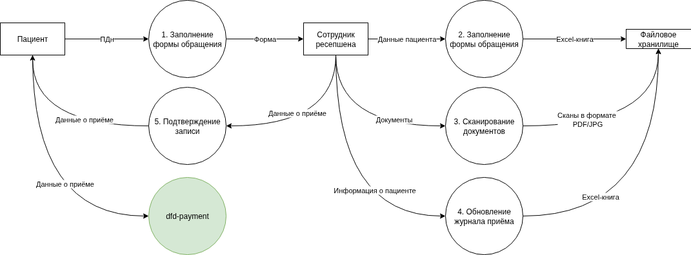
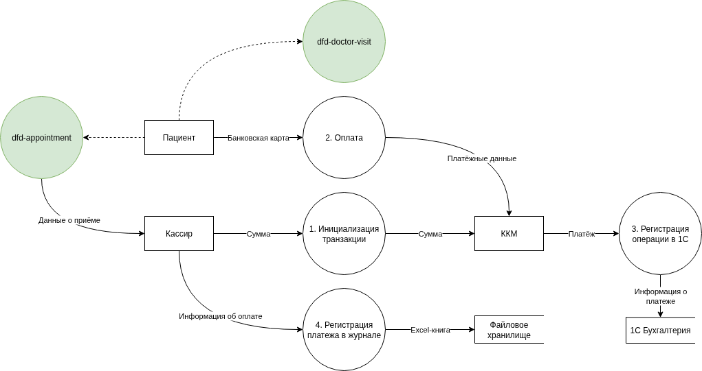
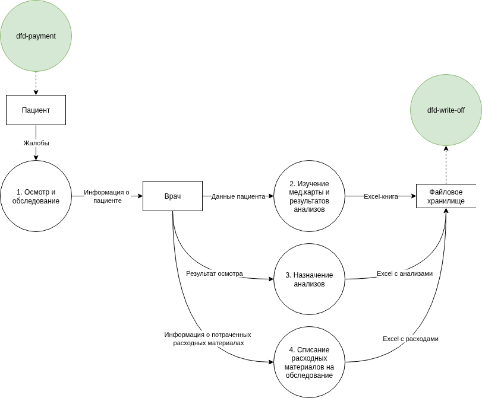
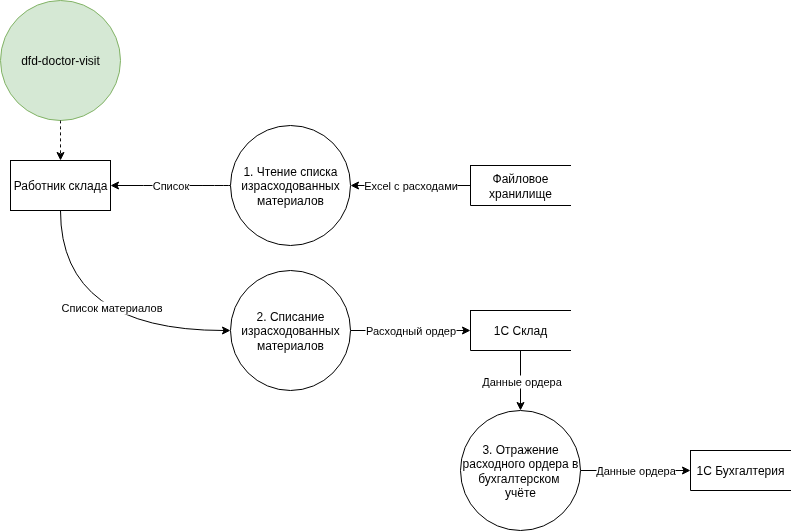
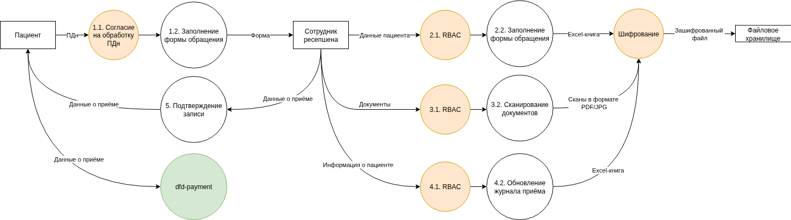
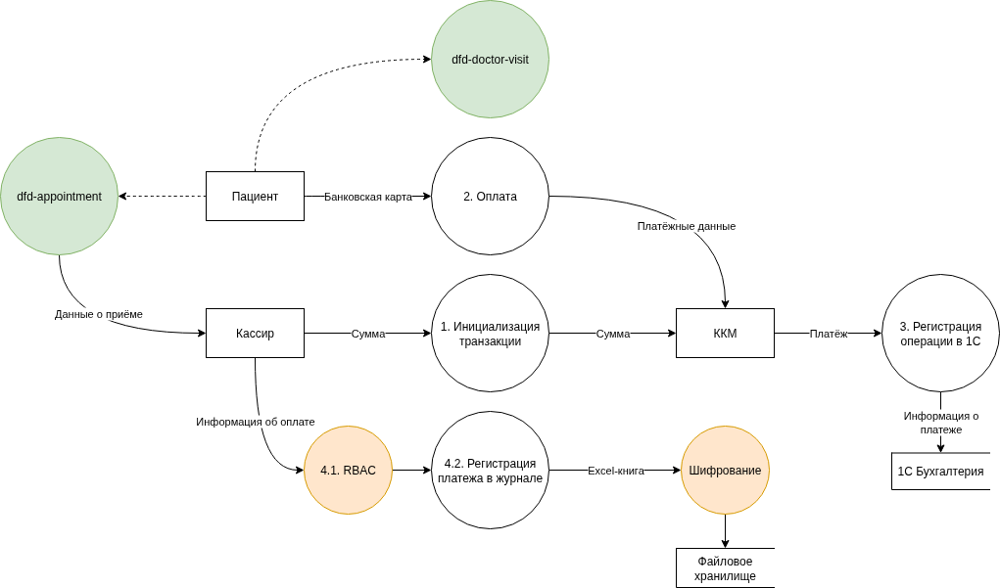
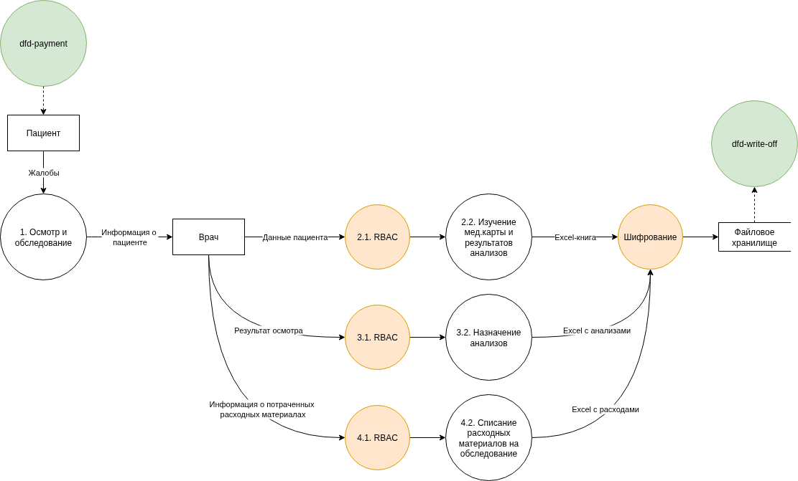
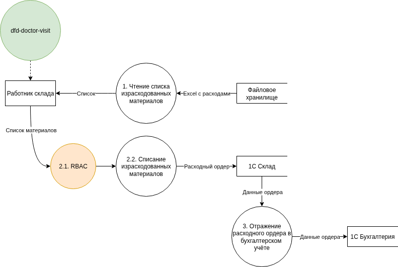

## Диаграммы потоков данных

- Проанализируйте информацию о компании.
- Создайте диаграммы потоков данных (Data Flow Diagrams). Для каждого процесса создайте отдельную диаграмму.
- Отобразите на них, как данные перемещаются по системам компании и какие операции над ними совершают.

### Запись на приём (as-is)

### Оплата приёма (as-is)

### Приём у врача (as-is)

### Списание расходных материалов (as-is)

## Аудит мер по обеспечению безопасности данных

- Сопоставьте процессы в компании с требованиями по обеспечению безопасности данных и архитектурными практиками в области безопасности конфиденциальных данных.
- Составьте список проблемных зон и сохраните его в отдельный документ.

| **Выявленная проблема**                                                                      | **Потенциальные риски**                                          | **Рекомендуемые меры защиты**                                    |
| -------------------------------------------------------------------------------------------- | ---------------------------------------------------------------- | ---------------------------------------------------------------- |
| Отсутствует процедура получения согласия пациента на обработку персональных данных           | Нарушение ФЗ-152 "О персональных данных"                         | Внедрение процедуры получения согласия                           |
| Конфиденциальные данные (ФИО, паспорт, мед. записи) хранятся в Excel и файлах без шифрования | Утечка информации, нарушение ФЗ-152 "О персональных данных"      | Внедрение шифрования, строгий контроль доступа, ведение журналов |
| Неограниченный доступ сотрудников к общим папкам с данными пациентов                         | Несанкционированный просмотр или копирование данных              | Внедрение системы RBAC/ABAC, предоставление минимальных прав     |
| Отсутствие системы аудита операций с данными                                                 | Невозможность выявления утечек или несанкционированных изменений | Внедрение логирования и мониторинга подозрительных действий      |
| Передача данных между системами без шифрования                                               | Перехват данных злоумышленниками                                 | Использование TLS, защищённых API с аутентификацией              |
| Хранение сканированных документов (паспорта, мед. карты) в незащищённом виде                 | Утечка персональных данных, репутационный ущерб                  | Обезличивание данных, использование защищённых хранилищ          |
| Отсутствие автоматизированного удаления устаревших данных                                    | Накопление избыточной информации, повышение риска утечки         | Внедрение политик хранения и автоматической очистки данных       |
## Предложения по модернизации

- Составьте список данных для защиты и проставьте для каждого способы защиты — шифрование, обфускация, обезличивание.
- Разработайте механизм тегирования данных с использованием инструментов тегирования.
- Составьте список инструментов, способов и мер, которые позволят обеспечить конфиденциальность данных в указанных потоках.
- Доработайте диаграммы из предыдущего шага: отобразите на них, что следует использовать на каждом этапе потока.

### Список данных для защиты

| **Категория информации**                                   | **Способы защиты**                   |
| ---------------------------------------------------------- | ------------------------------------ |
| Персональные данные (ФИО, паспортные данные, контакты)     | Применение шифрования, обезличивание |
| Медицинская информация (диагнозы, результаты обследований) | Применение шифрования, обезличивание |
| Финансовые данные (платёжные реквизиты)                    | Применение шифрования, обфускация    |
### Тегирование и меры защиты данных

| **Категория данных**   | **Тег**   | **Инструмент тегирования** | **Меры**      |
| ---------------------- | --------- | -------------------------- | ------------- |
| Персональные данные    | PII       | BigID                      | RBAC          |
| Медицинская информация | Medical   | Apache Atlas               | RBAC          |
| Платёжная информация   | Financial | BigID                      | PCI DSS аудит |

### Доработка диаграмм потоков данных

#### Запись на приём (to-be)

#### Оплата приёма (to-be)

#### Приём у врача (to-be)

### Списание расходных материалов (to-be)

