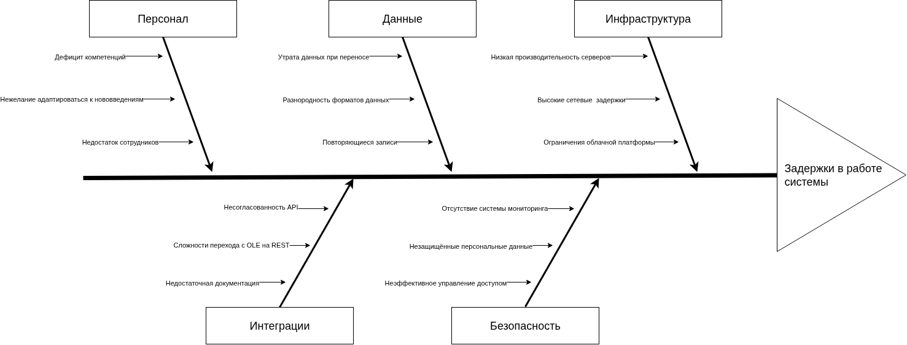

| Категория          | Проблема                                 | Потенциальные риски                     | Рекомендуемые действия                                                             | Приоритет |
| ------------------ | ---------------------------------------- | --------------------------------------- | ---------------------------------------------------------------------------------- | --------- |
| **Инфраструктура** | Низкая производительность серверов       | Замедление обработки данных             | Провести стресс-тесты, внедрить автоматическое масштабирование                     | Высокий   |
|                    | Высокие сетевые  задержки                | Снижение скорости работы сервисов       | Оптимизировать маршрутизацию, подключить CDN-сервисы                               | Средний   |
|                    | Ограничения облачной платформы           | Возможные перебои в работе              | Подписать SLA с гарантиями доступности, разработать план аварийного восстановления | Высокий   |
| **Данные**         | Утрата данных при переносе               | Повреждение медицинских записей         | Внедрить двухэтапную проверку, настроить резервное копирование                     | Критичный |
|                    | Разнородность форматов данных            | Некорректная интерпретация результатов  | Создать ETL-процесс с проверкой данных                                             | Высокий   |
|                    | Повторяющиеся записи                     | Противоречивые отчеты                   | Внедрить систему управления основными данными (MDM)                                | Средний   |
| **Персонал**       | Дефицит компетенций                      | Операционные ошибки                     | Организовать обучение по Kubernetes и микросервисной архитектуре                   | Средний   |
|                    | Нежелание адаптироваться к нововведениям | Замедление процессов модернизации       | Постепенно внедрять изменения, сохраняя старый функционал                          | Низкий    |
|                    | Недостаток сотрудников                   | Переутомление штатных специалистов      | Привлечь временных экспертов, передать сложные задачи на аутсорс                   | Высокий   |
| **Безопасность**   | Отсутствие системы мониторинга           | Сложности при расследовании сбоев       | Развернуть SIEM с длительным хранением журналов (12+ месяцев)                      | Высокий   |
|                    | Незащищённые персональные данные         | Юридические последствия по 152-ФЗ       | Внедрить комплексное шифрование (AES-256 + TLS)                                    | Критичный |
|                    | Неэффективное управление доступом        | Несанкционированный доступ к информации | Настроить ролевую модель с принципом минимальных прав                              | Высокий   |
| **Интеграции**     | Несогласованность API                    | Нарушения в работе лабораторных систем  | Разработать промежуточный слой для конвертации данных                              | Критичный |
|                    | Сложности перехода с OLE на REST         | Частичная потеря возможностей           | Реализовать сервис-посредник для совместимости                                     | Высокий   |
|                    | Недостаточная документация               | Увеличение сроков разработки            | Автоматизировать генерацию Swagger-спецификаций для API                            | Средний   |
